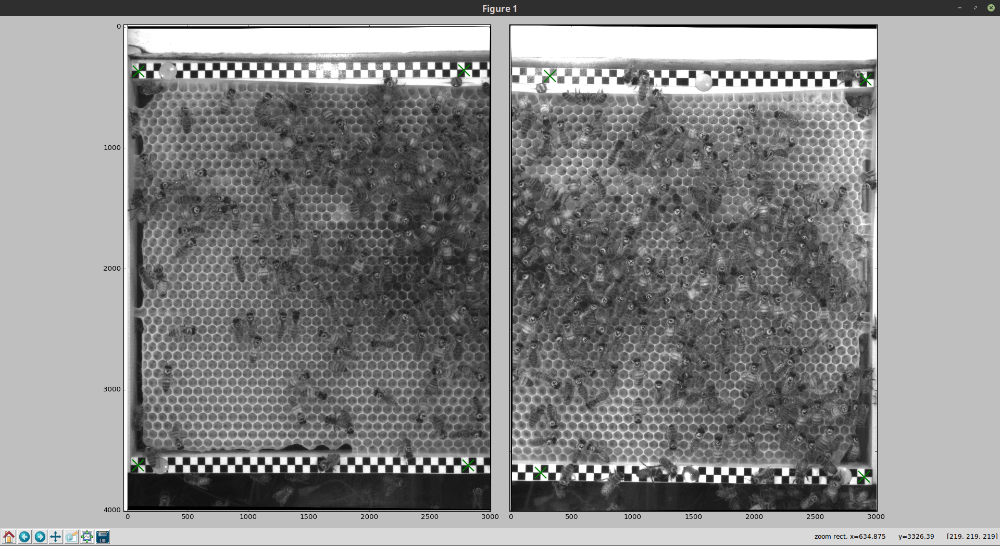
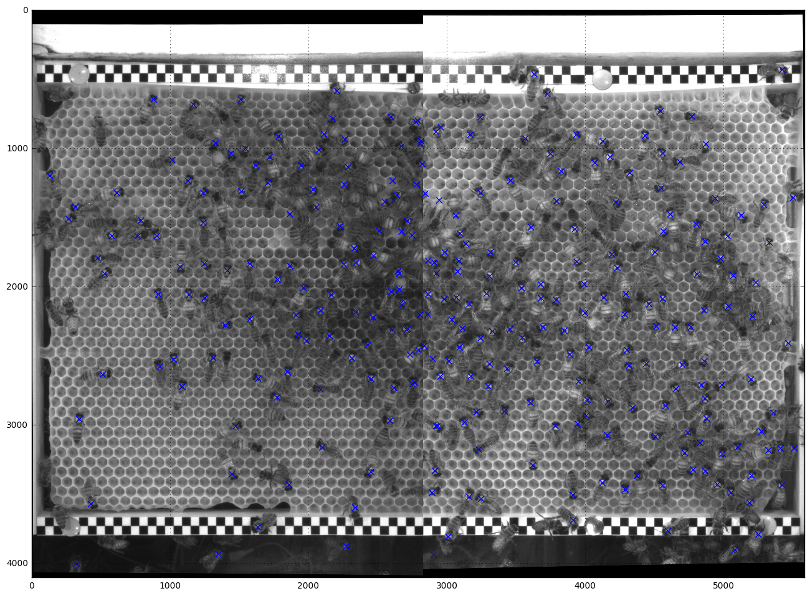

# bb_composer


 https://gitmirgut.github.io/bb_composer

# 1. Parameter des Composers bestimmen

 Zuerst müssen die Parameter für den Composer bestimmt werden, die erzeugte Datei enthält dann alle benötigten Informationen um Punkte und Bilder, welche unter der gleichen Kamerakonfiguration erstellt wurden, auf ein gemeinsames Koordinatensystem abbzubilden.

 Struktur:
 ```bash
 $ bb_composer <left_img> <right_img> <camera_params> <out_composer_params>
 ```

 konkretes Bsp.:
 ```bash
 $ bb_composer Input/Cam_0_20160715130847_631282.jpg Input/Cam_1_20160715130847_631282.jpg Input/camera_params.npz composer_params.npz
 ```

 (```camera_params.npz``` für die PointGrey Flea3 Camera mit dem Objektiv RICOH FL-CC1214A-2M kann hier runtergeladen werden:
 https://github.com/gitmirgut/bb_composer/blob/gh-pages/camera_params.npz)

Es wird dann nachfolgend ein Fenster mit den rektifizierten Bildern erzeugt.
Auf beiden Seiten können dann jeweils 4 Punkte ausgwählt werden. Diese 4 Punkte
sollten in den Weltkoordinaten des Bienestockes ein Rechteck bilden. (Die
gesetzten Punkte können noch im Nachhinein verschoben werden). Befindet sich die
Maus über einem Marker und wird die Taste '```b```' gedrückt, wird die Markerpostion ver```b```essert, dies ist optisch durch eine grüne Farbe gekennzeichnet. Jeweils zwei der ausgewählten Punkte, welche im Überlappungsbereich der beiden Bilder liegen, sollten einander in Weltkoordinaten entsprechen. Sind alle Punkte gesetzt kann das Fenster geschlossen werden.



Schlussendlich wird die Datei ```out_composer_params``` erzeugt und ein Preview-Bild eines Panorams der beiden verwendeten Bilder angezeigt.
Die Datei ```out_composer_params``` kann dann nachfolgend in der Pipeline geladen werden und dient der Überführung der  ```Positions``` in ```HivePositions```

# 2. Bestimmung der Koordinaten bzgl. des Gesamtbildes


 ```python
 %matplotlib inline
 ```


 ```python
 import matplotlib.pyplot as plt
 import numpy as np
 import composer.core
 import cv2
 from pipeline import Pipeline
 from pipeline.objects import CamParameter, Image, Filename, Positions, HivePositions, CandidateOverlay
 from pipeline.pipeline import get_auto_config
 ```

     Using Theano backend.


 Initialisieren der pipeline, wobei als Input neben dem ```Filename``` auch  ```CamParameter``` aufgeührt sein muss.


 ```python
 pipeline = Pipeline([Filename, CamParameter],  # inputs
                     [Image, Positions, HivePositions],  # outputs
                     **get_auto_config())
 ```

 Laden der Bilder und Composer Parameter:

 (Es werden hier zwei Bilder geladen um das Ergebnis später innerhalb eines Panoramas zu überprüfen)


 ```python
 img_l = 'Input/Cam_0_20160715130847_631282.jpg'
 img_r = 'Input/Cam_1_20160715130847_631282.jpg'
 img_left_org = cv2.imread(img_l)
 img_right_org = cv2.imread(img_r)
 composer_params = 'composer_params.npz'
 ```

 Pipline auf das linke, sowie rechte Bild anwenden:


 ```python
 res_l=pipeline([img_l, composer_params])
 res_r=pipeline([img_r, composer_params])
 ```

 Die ursprünglichen Koordinaten bzgl. des rechten Bildes:


 ```python
 res_r[Positions]
 ```


     array([[ 1314.90612984,    76.63876724],
            [ 3149.95760727,    73.24475765],
            [ 2374.43832111,   115.27530098],
            [  399.36408043,   150.22371292],
            [ 3424.9200058 ,   163.96108627],
            [ 3149.19769096,   175.08439827],
            ...])


 ```python
 res_r[HivePositions]
 ```


     array([[ 1361.78511797,  5496.20516797],
            [ 3170.78305523,  5506.49496076],
            [ 2412.59713481,  5462.22370878],
            [  436.444563  ,  5417.16156451],
            [ 3439.52711997,  5418.01677659],
            [ 3171.31600987,  5406.15466187],
            ....])


# 3. bildliche Überprüfung

 Zusammenführung der Punkte aus dem linken sowie rechten Bild:


 ```python
 pts_l = res_l[HivePositions]
 pts_r = res_r[HivePositions]
 pts = np.vstack((pts_l, pts_r))
 pts[:,[0, 1]] = pts[:,[1, 0]] #  swap y, x --> x, y
 ```


 ```python
 c = composer.core.Composer()
 c.load_arguments(composer_params)
 res = c.compose_and_mark(img_left_org,img_right_org, np.array([pts]))
 ```


 ```python
 plt.figure(figsize=(16, 16))
 plt.imshow(res, cmap=plt.cm.gray)
 plt.grid()
 plt.show()
 ```


 


 cv2.imwrite('result.jpg', res)
